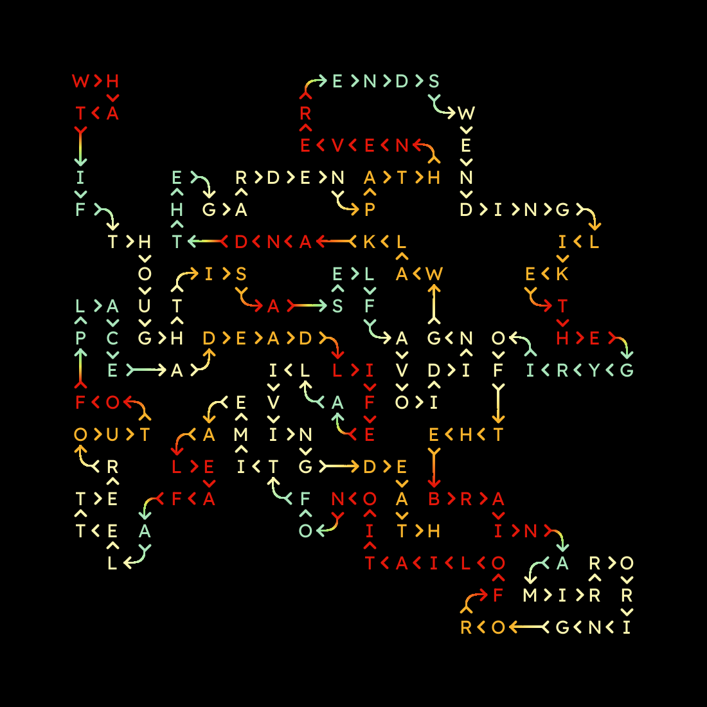
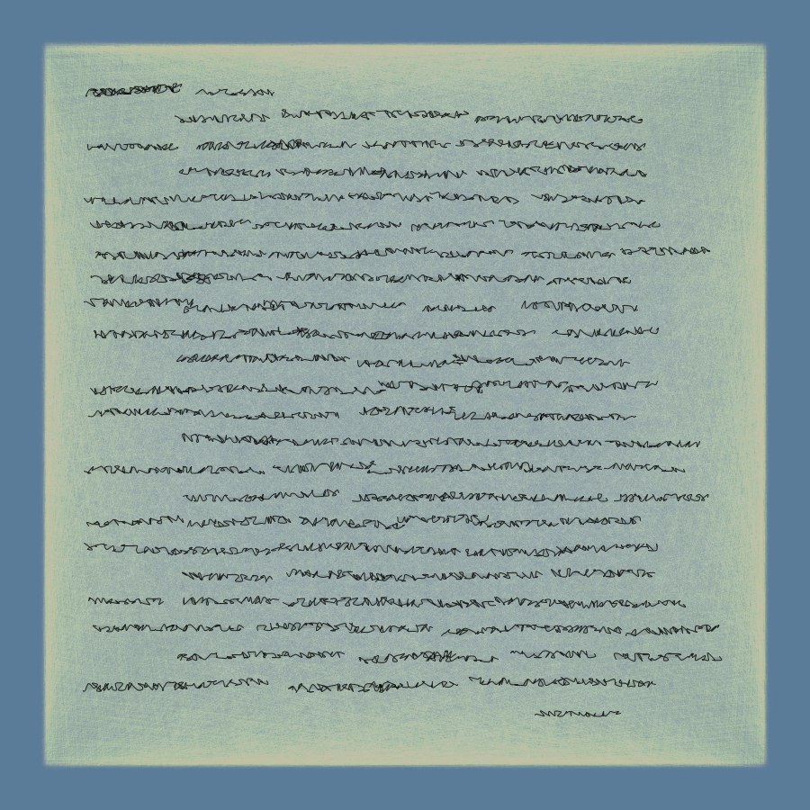
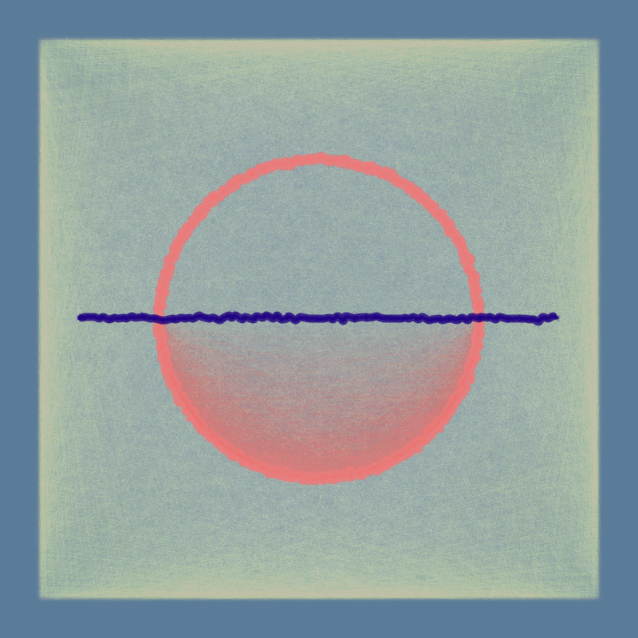
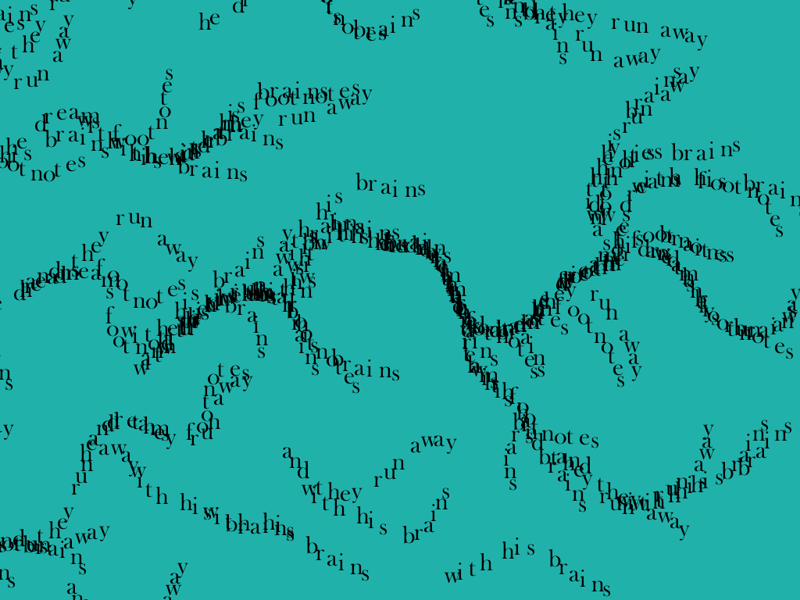
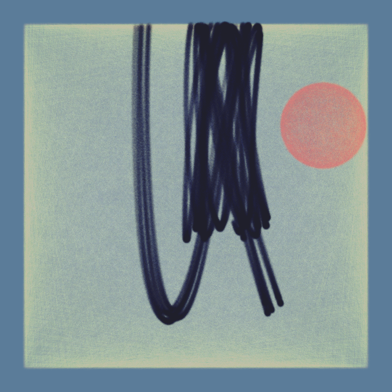
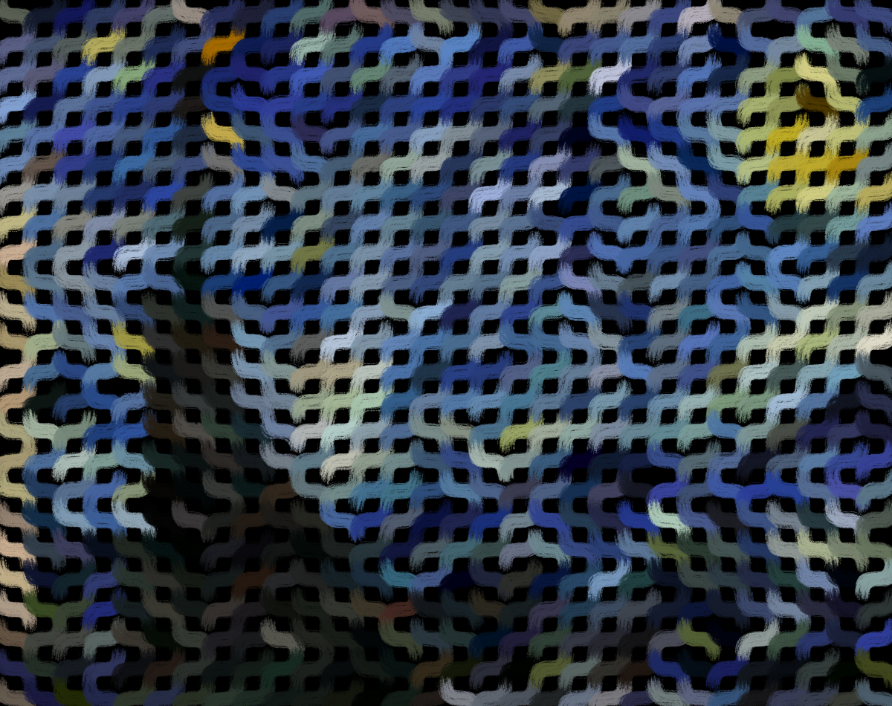
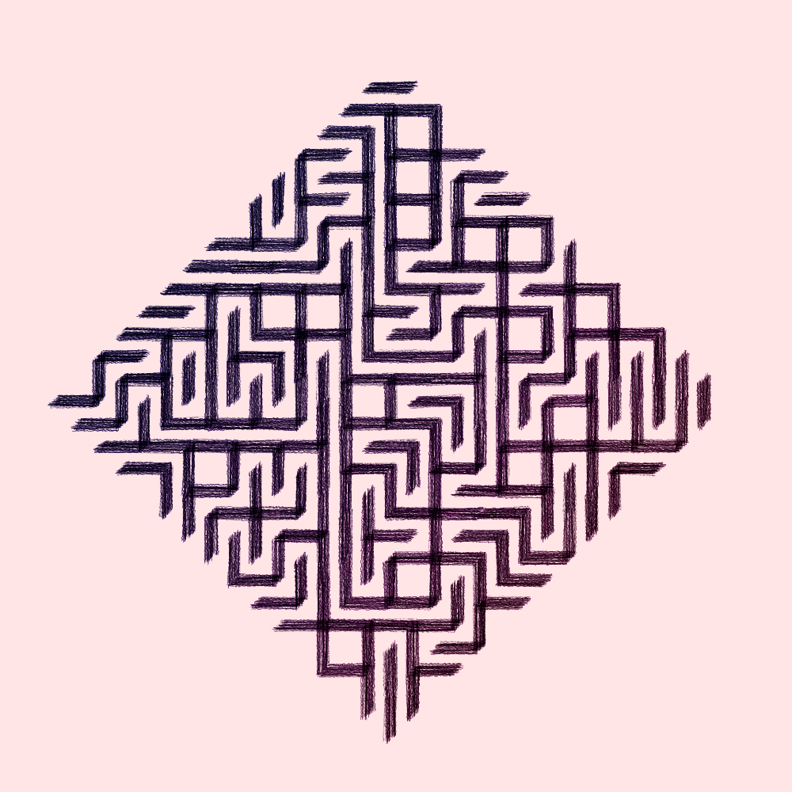
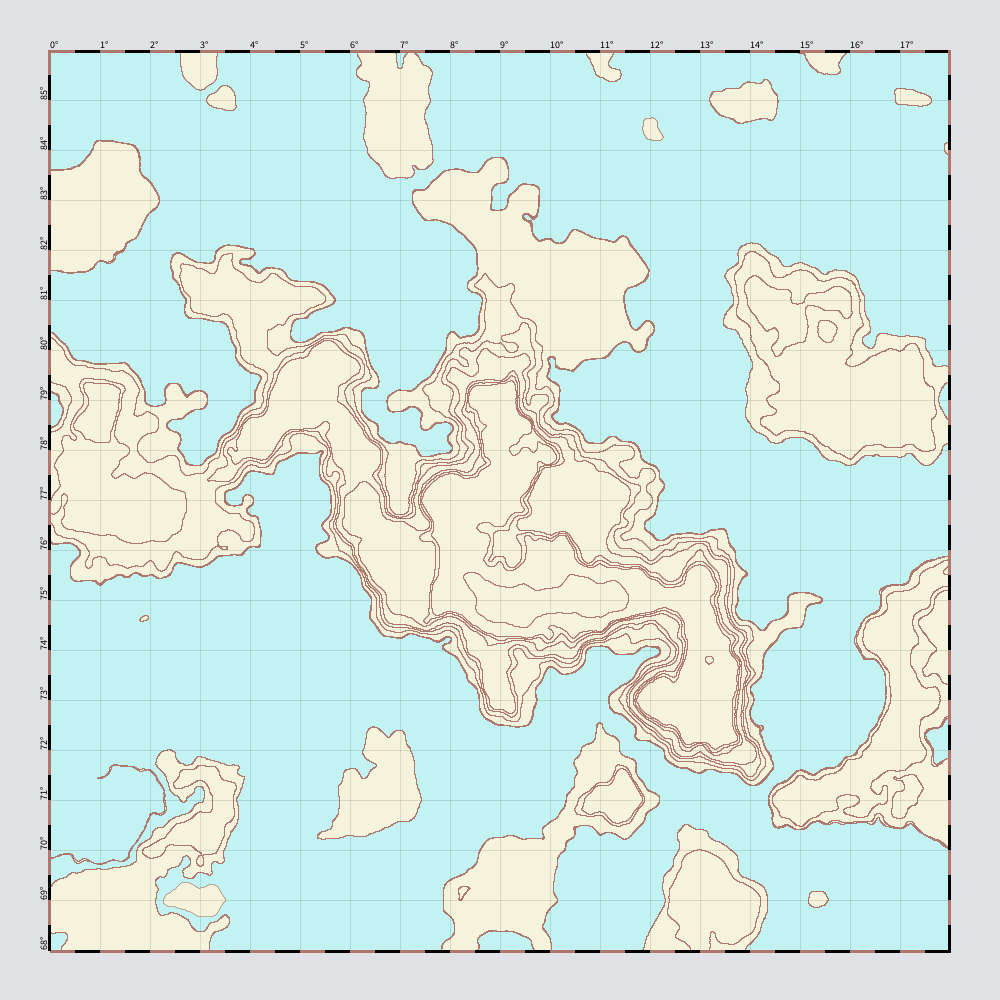
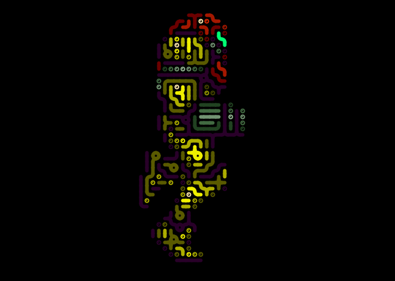
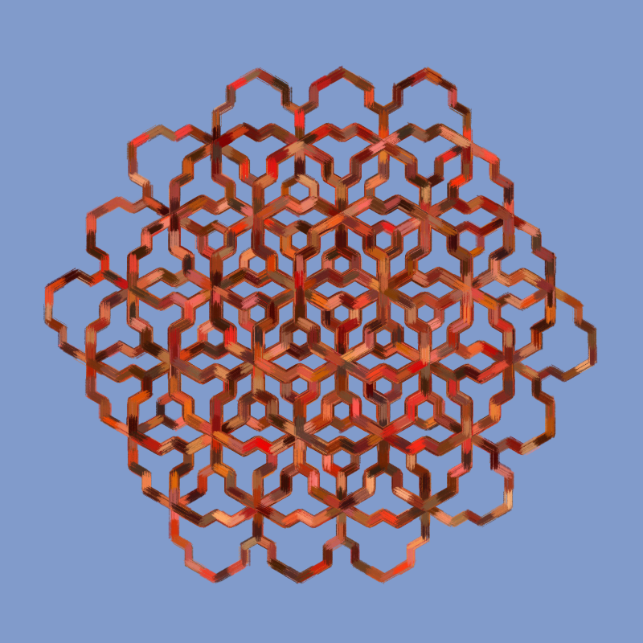

# GenArt
Generative Art Experiments

Though this is currently meant as a general dump of the art I've created, primarily for backup purposes, public pull requests, comments, issues, and suggestions are welcome.

Most, if not all, sketches were written in the [Processing Framework](https://processing.org/).

## Sample Gallery

