<!-- GALLERY:START -->
## Gallery

- [Explorations](#explorations)
- [Projects](#projects)

### Explorations

<table>
<tbody>
<tr>
<td align="center" valign="top" style="padding:6px;">       3dlorenzanimation</td>
<td align="center" valign="top" style="padding:6px;">       3d Perlinflowfield</td>
<td align="center" valign="top" style="padding:6px;">    <a href="explorations/80sTime/mySketch1656130054860.webp">    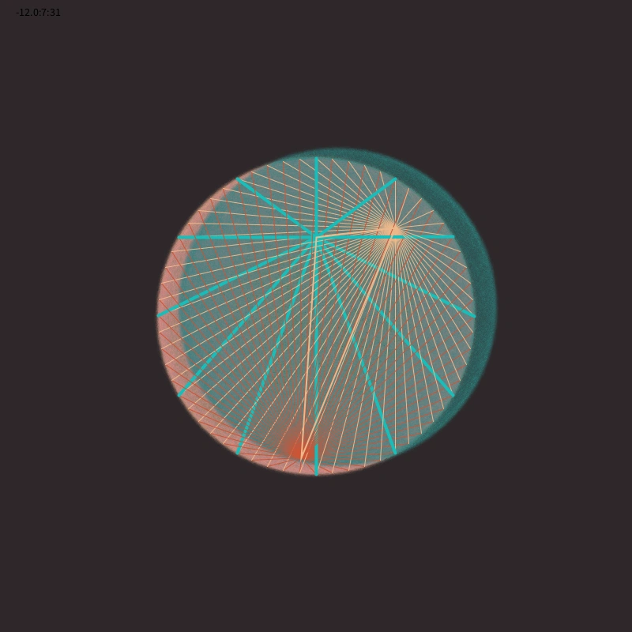  </a>   80stime</td>
<td align="center" valign="top" style="padding:6px;">    <a href="explorations/AngularJellyFish/output.webp">    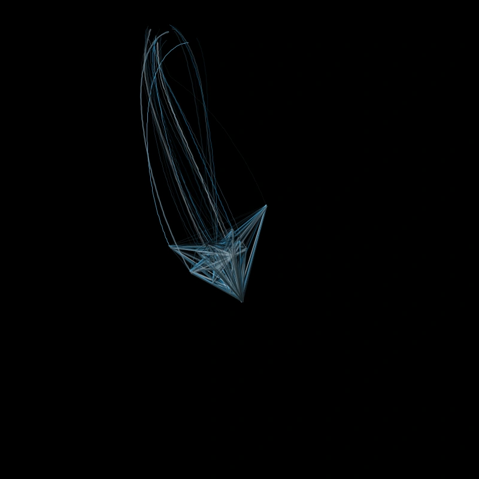  </a>   Angularjellyfish</td>
</tr>
<tr>
<td align="center" valign="top" style="padding:6px;">       Asemiclayout</td>
<td align="center" valign="top" style="padding:6px;">       Cielablikenessfilter</td>
<td align="center" valign="top" style="padding:6px;">       Doctorsnote</td>
<td align="center" valign="top" style="padding:6px;">       Mondrianripoff</td>
</tr>
<tr>
<td align="center" valign="top" style="padding:6px;">       Moraffmap</td>
<td align="center" valign="top" style="padding:6px;">       Mrdna</td>
<td align="center" valign="top" style="padding:6px;">       Noisyca</td>
<td align="center" valign="top" style="padding:6px;">       Quadtreetruchet</td>
</tr>
<tr>
<td align="center" valign="top" style="padding:6px;">       Aceofpents</td>
<td align="center" valign="top" style="padding:6px;">       Agentexperiment</td>
<td align="center" valign="top" style="padding:6px;">       Allworkandnoplay</td>
<td align="center" valign="top" style="padding:6px;">    <a href="explorations/america_meme/memewtext.webp">    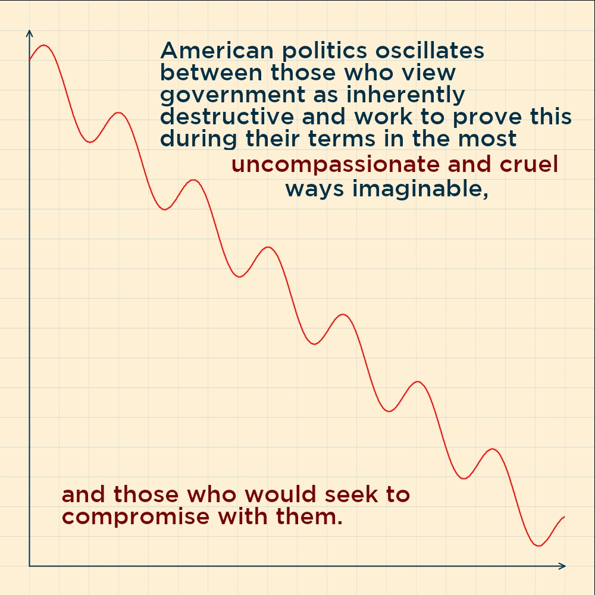  </a>   America Meme</td>
</tr>
<tr>
<td align="center" valign="top" style="padding:6px;">       Archipeligos</td>
<td align="center" valign="top" style="padding:6px;">    <a href="explorations/asciicam/test.webp">    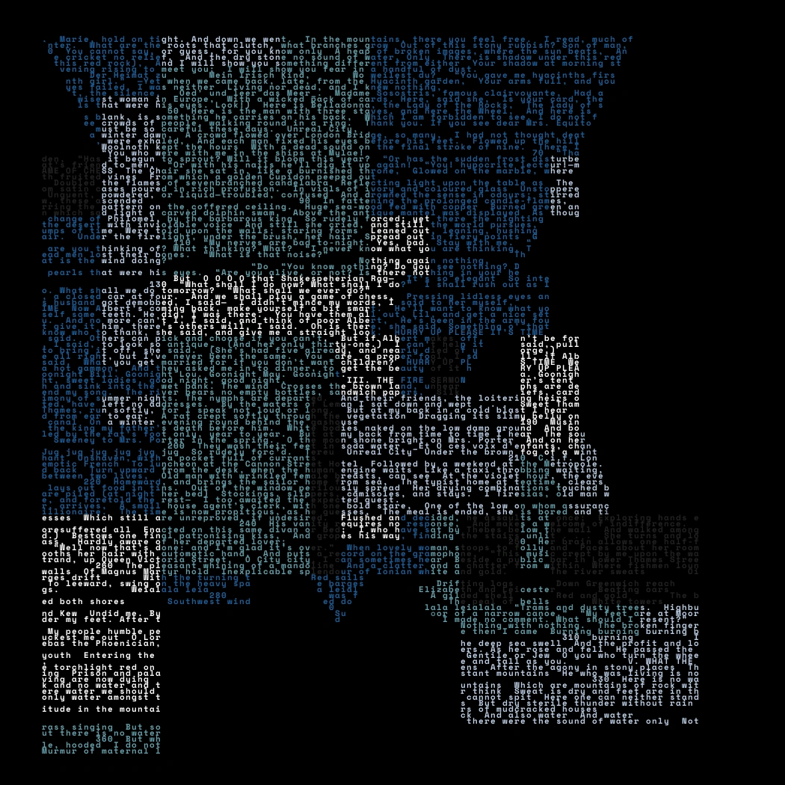  </a>   Asciicam</td>
<td align="center" valign="top" style="padding:6px;">    <a href="explorations/attractors/13.webp">    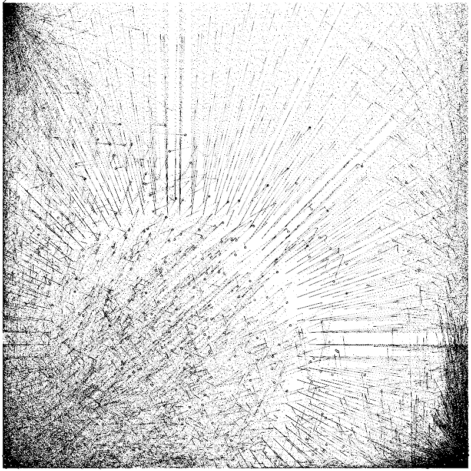  </a>   Attractors</td>
<td align="center" valign="top" style="padding:6px;">       Bitfield</td>
</tr>
<tr>
<td align="center" valign="top" style="padding:6px;">       Bouncyarcs</td>
<td align="center" valign="top" style="padding:6px;">    <a href="explorations/brush/mySketch1653421992707.webp">    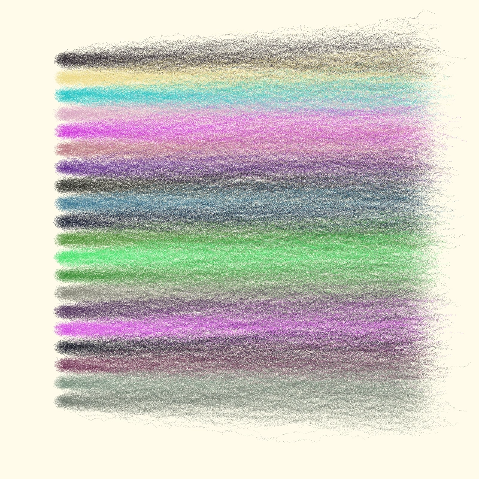  </a>   Brush</td>
<td align="center" valign="top" style="padding:6px;">       Brushcurve</td>
<td align="center" valign="top" style="padding:6px;">       Bugcollection</td>
</tr>
<tr>
<td align="center" valign="top" style="padding:6px;">       Candyfactory</td>
<td align="center" valign="top" style="padding:6px;">       Chladni</td>
<td align="center" valign="top" style="padding:6px;">    <a href="explorations/circleBrushExperiment/circleBrushExperiment1676169266965.webp">    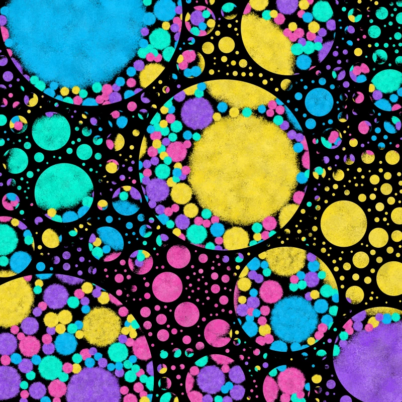  </a>   Circlebrushexperiment</td>
<td align="center" valign="top" style="padding:6px;">       Circlepackbymovingagents</td>
</tr>
<tr>
<td align="center" valign="top" style="padding:6px;">       Crtsim</td>
<td align="center" valign="top" style="padding:6px;">    <a href="explorations/dad_commission/gif-049.webp">    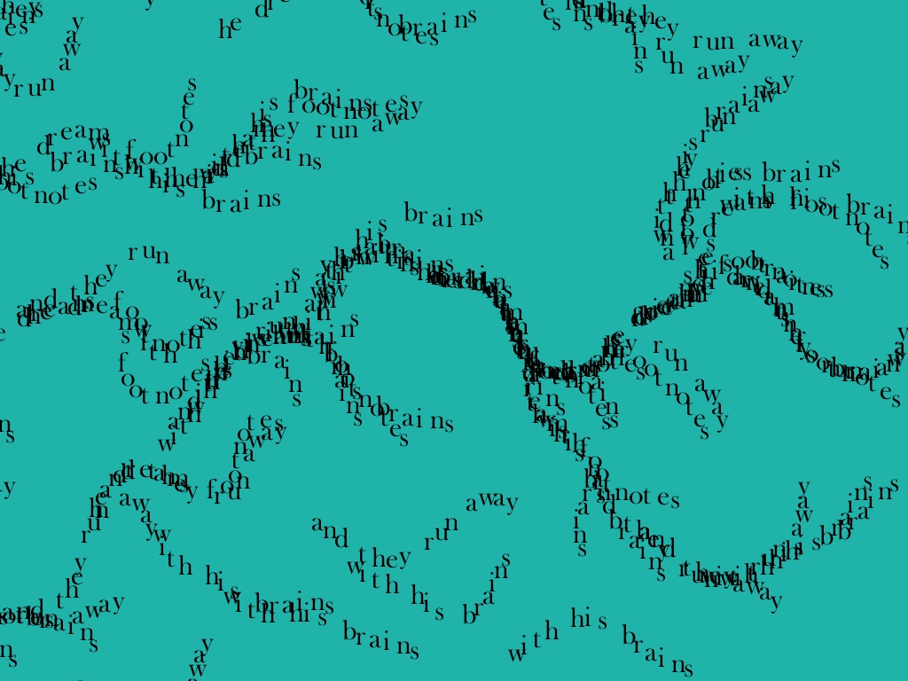  </a>   Dad Commission</td>
<td align="center" valign="top" style="padding:6px;">       Dejong</td>
<td align="center" valign="top" style="padding:6px;">       Dejongattractor</td>
</tr>
<tr>
<td align="center" valign="top" style="padding:6px;">    <a href="explorations/dontTouchTheBoard/000.webp">    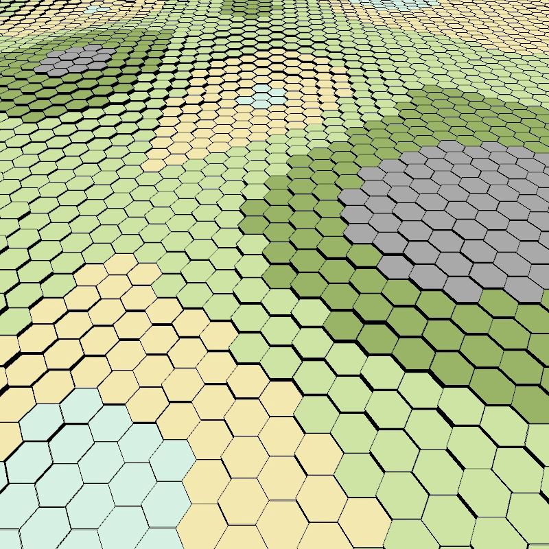  </a>   Donttouchtheboard</td>
<td align="center" valign="top" style="padding:6px;">       Dragon</td>
<td align="center" valign="top" style="padding:6px;">       Efficientcube</td>
<td align="center" valign="top" style="padding:6px;">       Fbm</td>
</tr>
<tr>
<td align="center" valign="top" style="padding:6px;">       Fiberflows</td>
<td align="center" valign="top" style="padding:6px;">       Flowerfield</td>
<td align="center" valign="top" style="padding:6px;">       Flowersoflife</td>
<td align="center" valign="top" style="padding:6px;">       Folds</td>
</tr>
<tr>
<td align="center" valign="top" style="padding:6px;">       Geodivinity</td>
<td align="center" valign="top" style="padding:6px;">    <a href="explorations/geomancy/1.webp">    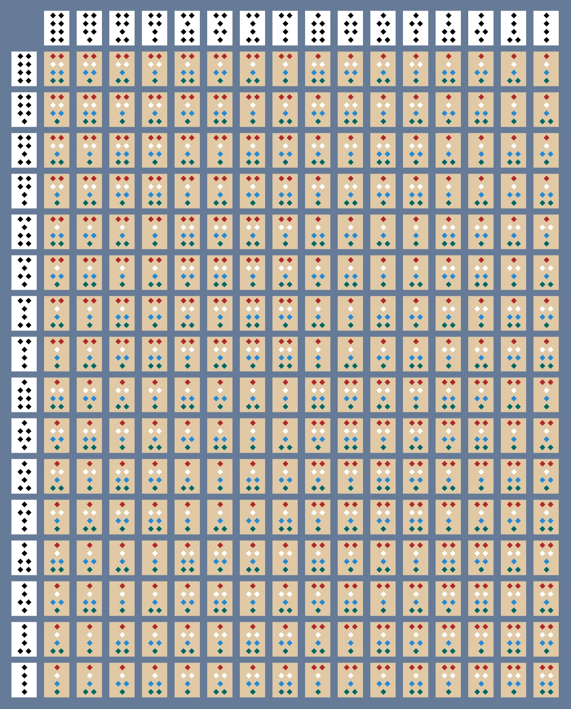  </a>   Geomancy</td>
<td align="center" valign="top" style="padding:6px;">       Gravitysketch</td>
<td align="center" valign="top" style="padding:6px;">       Griddumbagent</td>
</tr>
<tr>
<td align="center" valign="top" style="padding:6px;">    <a href="explorations/julia/1657075009757.webp">    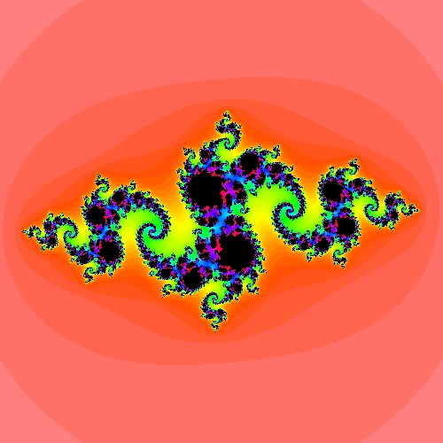  </a>   Julia</td>
<td align="center" valign="top" style="padding:6px;">       Latticecurvefilter</td>
<td align="center" valign="top" style="padding:6px;">       Linestudy</td>
<td align="center" valign="top" style="padding:6px;">       Lorenz Side Animation</td>
</tr>
<tr>
<td align="center" valign="top" style="padding:6px;">       Messy 10print</td>
<td align="center" valign="top" style="padding:6px;">       Mountainsagain</td>
<td align="center" valign="top" style="padding:6px;">       Mountainsrnice</td>
<td align="center" valign="top" style="padding:6px;">       Mzoom</td>
</tr>
<tr>
<td align="center" valign="top" style="padding:6px;">       Neoncity</td>
<td align="center" valign="top" style="padding:6px;">       Nightgrass</td>
<td align="center" valign="top" style="padding:6px;">       Noise Circlepack</td>
<td align="center" valign="top" style="padding:6px;">       Noisyrot</td>
</tr>
<tr>
<td align="center" valign="top" style="padding:6px;">       Noisytiles</td>
<td align="center" valign="top" style="padding:6px;">       Oo Fractree</td>
<td align="center" valign="top" style="padding:6px;">       Perlinwarrior</td>
<td align="center" valign="top" style="padding:6px;">       Perlin Flying</td>
</tr>
<tr>
<td align="center" valign="top" style="padding:6px;">       Primespiral</td>
<td align="center" valign="top" style="padding:6px;">       Pulsing10print</td>
<td align="center" valign="top" style="padding:6px;">    <a href="explorations/reactionDiffusion/11193728.webp">    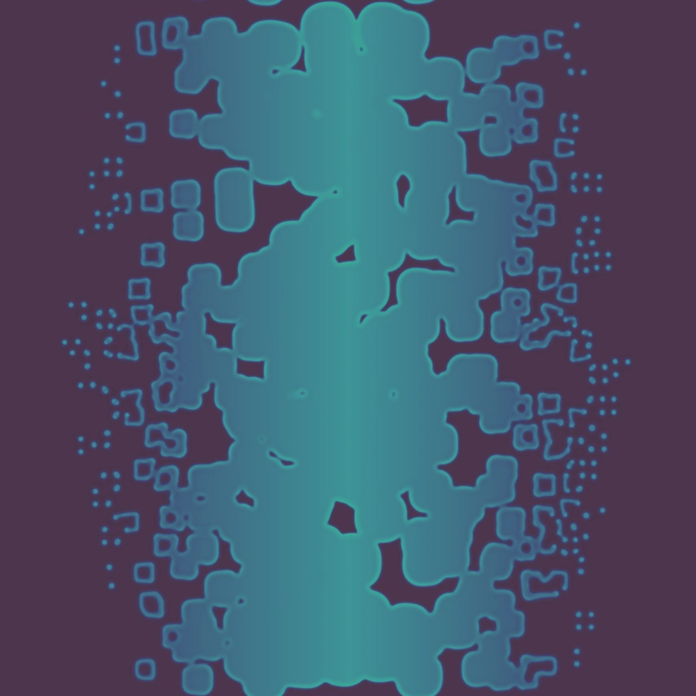  </a>   Reactiondiffusion</td>
<td align="center" valign="top" style="padding:6px;">       Recursiveirregulargrid</td>
</tr>
<tr>
<td align="center" valign="top" style="padding:6px;">       Recursiveshellgame</td>
<td align="center" valign="top" style="padding:6px;">       Recursivesquares</td>
<td align="center" valign="top" style="padding:6px;">       Sebstem</td>
<td align="center" valign="top" style="padding:6px;">       Sebissay Codebase</td>
</tr>
<tr>
<td align="center" valign="top" style="padding:6px;">       Shader Conway</td>
<td align="center" valign="top" style="padding:6px;">       Shapefilter</td>
<td align="center" valign="top" style="padding:6px;">    <a href="explorations/simplexQt/output.webp">    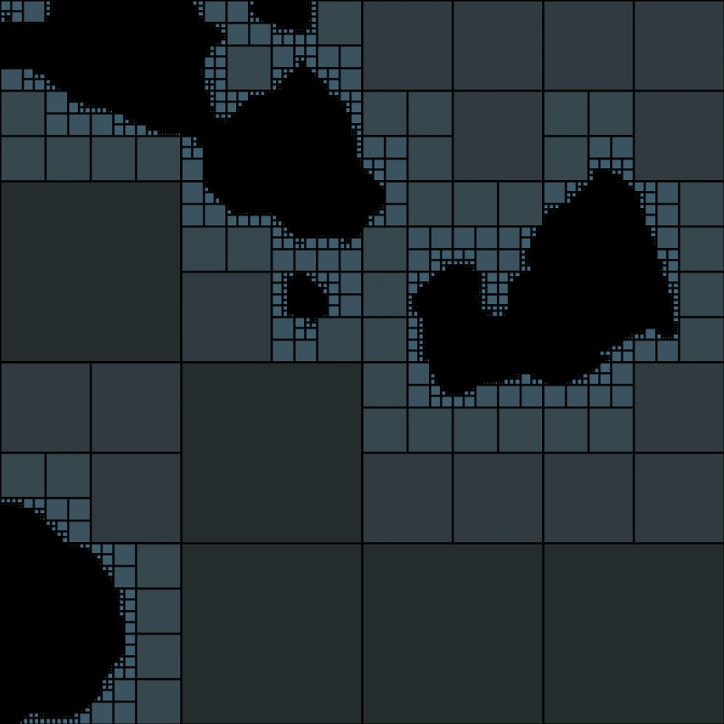  </a>   Simplexqt</td>
<td align="center" valign="top" style="padding:6px;">       Sinplot</td>
</tr>
<tr>
<td align="center" valign="top" style="padding:6px;">       Sketch 3dca</td>
<td align="center" valign="top" style="padding:6px;">       Spinningcubes</td>
<td align="center" valign="top" style="padding:6px;">       Squarepacking</td>
<td align="center" valign="top" style="padding:6px;">       Sunset</td>
</tr>
<tr>
<td align="center" valign="top" style="padding:6px;">       Territory</td>
<td align="center" valign="top" style="padding:6px;">    <a href="explorations/textThetas/8.webp">    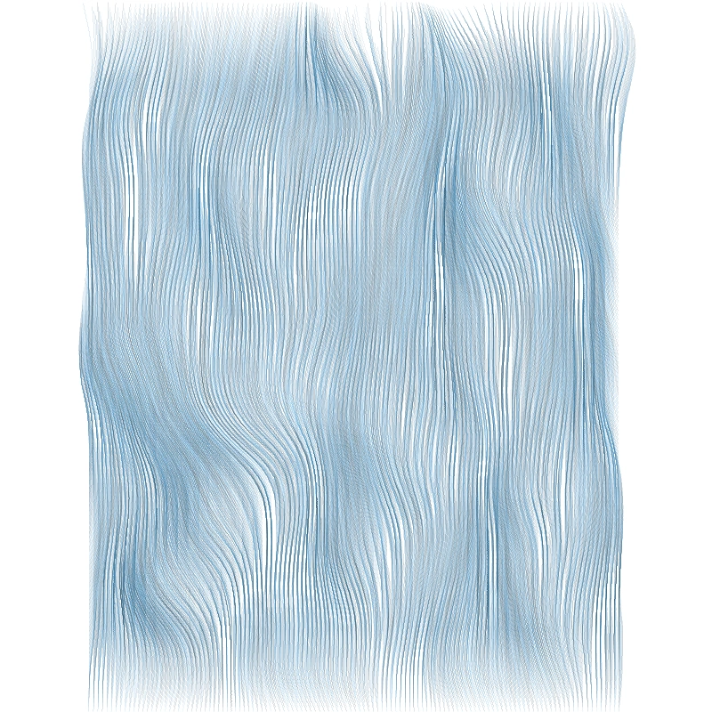  </a>   Textthetas</td>
<td align="center" valign="top" style="padding:6px;">       Texturepack</td>
<td align="center" valign="top" style="padding:6px;">       Texturedlsystem</td>
</tr>
<tr>
<td align="center" valign="top" style="padding:6px;">       Uniformtriangle</td>
<td align="center" valign="top" style="padding:6px;">    <a href="explorations/voronoi_lorenz/test.webp">    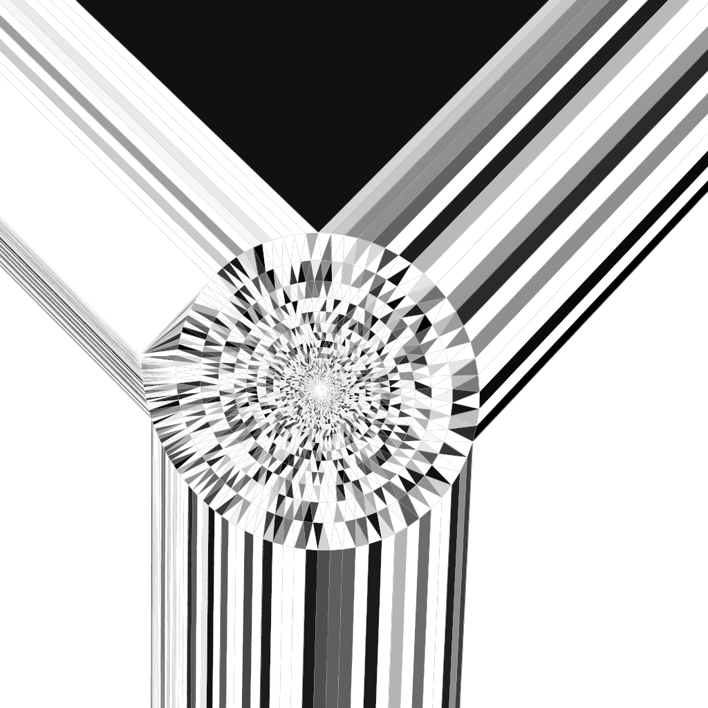  </a>   Voronoi Lorenz</td>
<td align="center" valign="top" style="padding:6px;">       Walkerheart</td>
<td align="center" valign="top" style="padding:6px;">       Warpspeedsvg</td>
</tr>
</tbody>
</table>

### Projects

<table>
<tbody>
<tr>
<td align="center" valign="top" style="padding:6px;">    <a href="projects/crepuscular/mySketch1652992364061.webp">    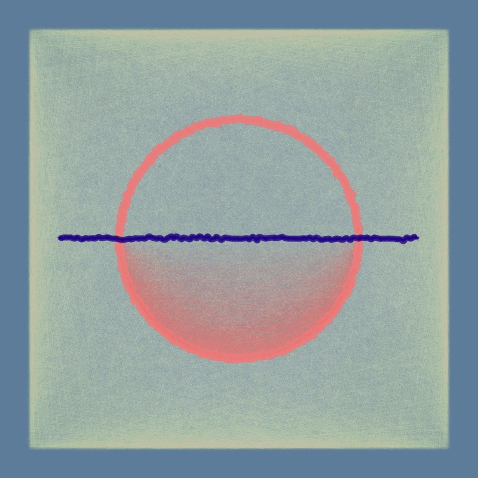  </a>   Crepuscular</td>
<td align="center" valign="top" style="padding:6px;">       Cresecentdoodles</td>
<td align="center" valign="top" style="padding:6px;">       Cubistfilter</td>
<td align="center" valign="top" style="padding:6px;">       Gentleprison</td>
</tr>
<tr>
<td align="center" valign="top" style="padding:6px;">       Heavens</td>
<td align="center" valign="top" style="padding:6px;">       Markovnodes</td>
<td align="center" valign="top" style="padding:6px;">    <a href="projects/mazes/1.webp">    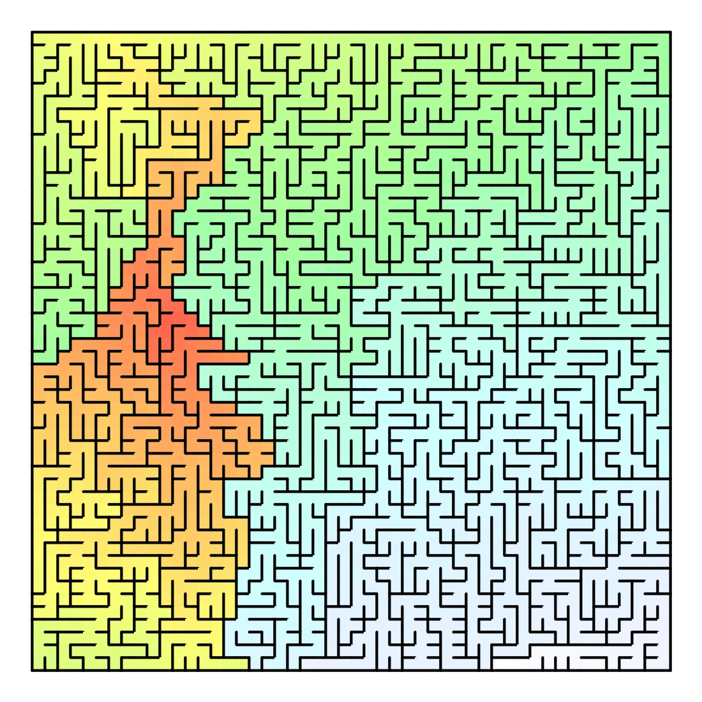  </a>   Mazes</td>
<td align="center" valign="top" style="padding:6px;">    <a href="projects/minimalBoard/bg1.webp">    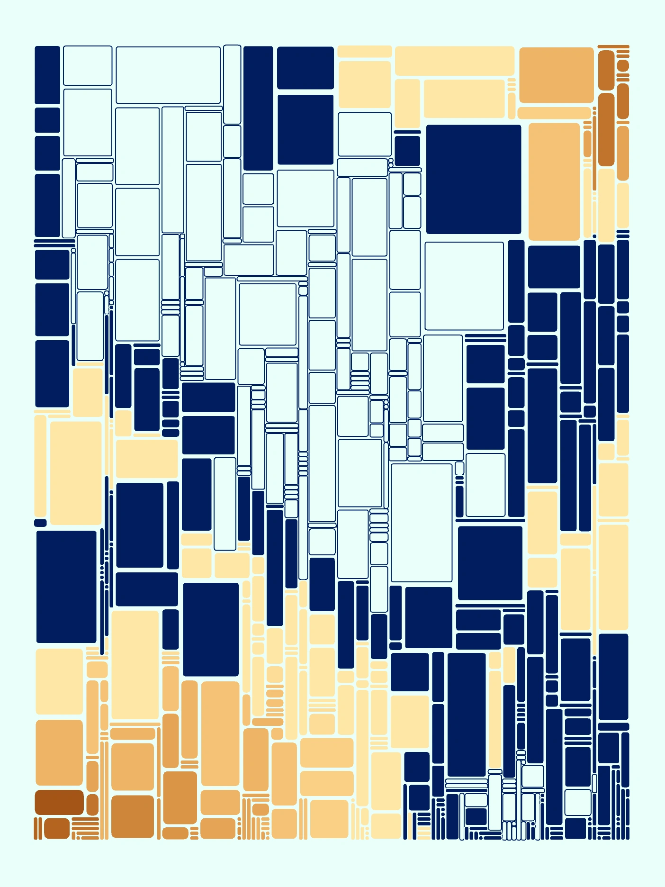  </a>   Minimalboard</td>
</tr>
<tr>
<td align="center" valign="top" style="padding:6px;">       Patchwork</td>
<td align="center" valign="top" style="padding:6px;">       Perlincontours</td>
<td align="center" valign="top" style="padding:6px;">       Pollockripoff</td>
<td align="center" valign="top" style="padding:6px;">    <a href="projects/polyFilter/mySketch1715026032835.webp">    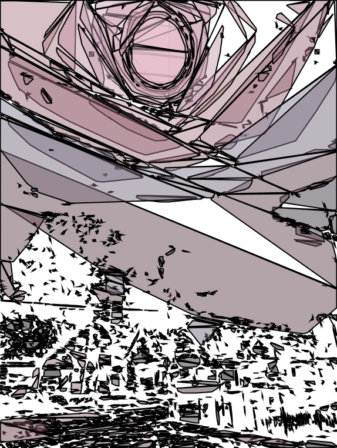  </a>   Polyfilter</td>
</tr>
<tr>
<td align="center" valign="top" style="padding:6px;">       Polysplit</td>
<td align="center" valign="top" style="padding:6px;">       Radar</td>
<td align="center" valign="top" style="padding:6px;">       Ribbons</td>
<td align="center" valign="top" style="padding:6px;">    <a href="projects/spiralAgent/output.webp">    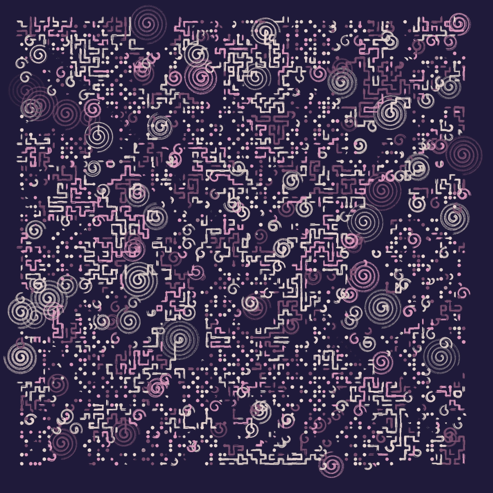  </a>   Spiralagent</td>
</tr>
<tr>
<td align="center" valign="top" style="padding:6px;">    <a href="projects/symmetryMath/2.webp">    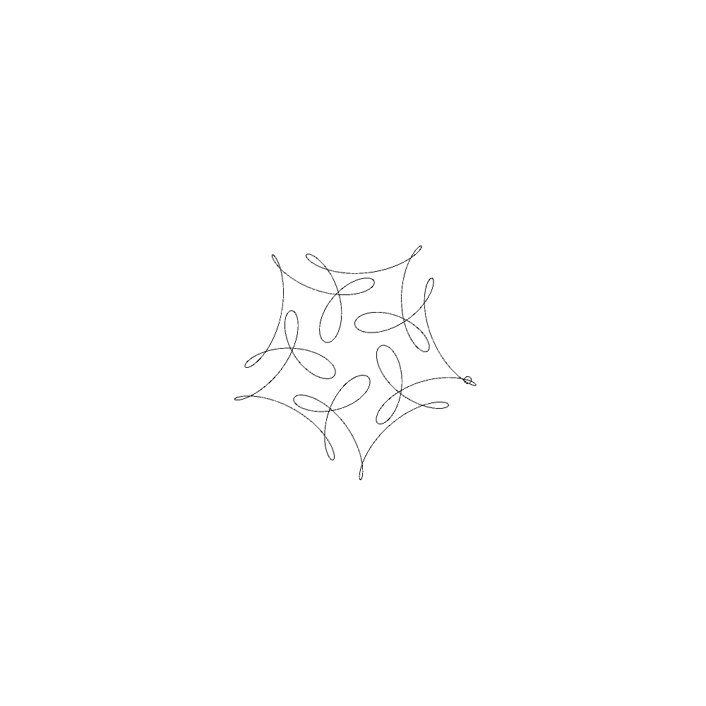  </a>   Symmetrymath</td>
<td align="center" valign="top" style="padding:6px;">       Thoughtavoidingwalk</td>
<td align="center" valign="top" style="padding:6px;">       Wordcloud</td>
<td></td>
</tr>
</tbody>
</table>

<!-- GALLERY:END -->
