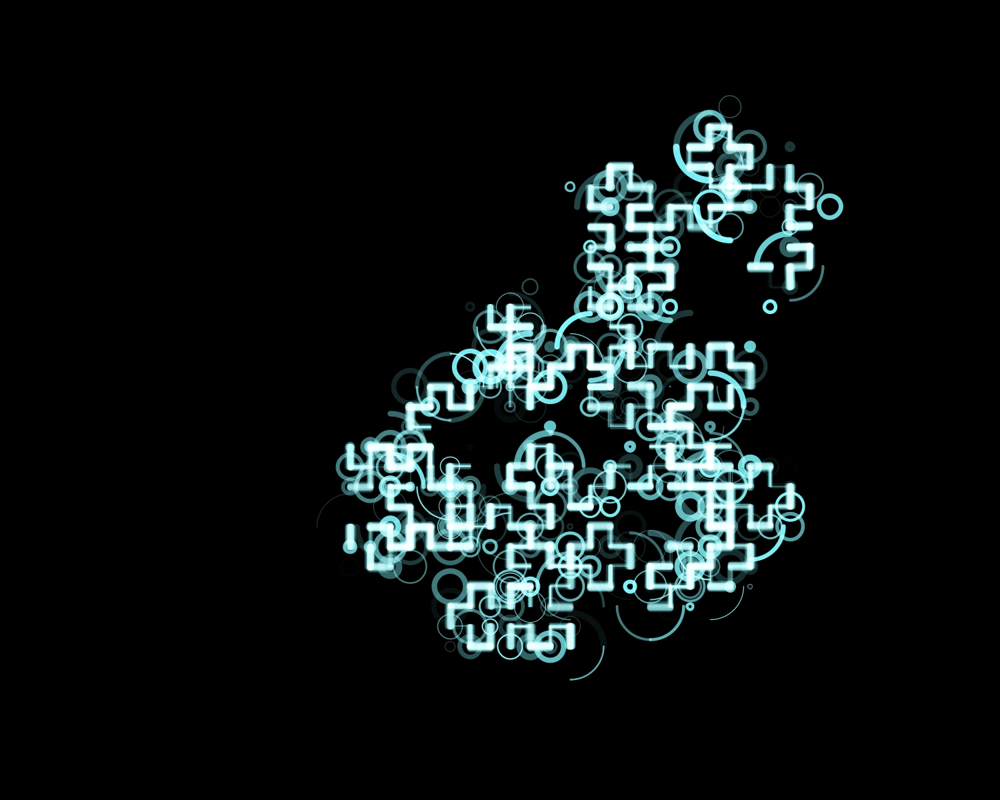

<!-- GALLERY:START -->
## Gallery

- [Explorations](#explorations)
- [Projects](#projects)

### Explorations

<table>
<tbody>
<tr>
<td align="center" valign="top" style="padding:6px;">       3dlorenzanimation</td>
<td align="center" valign="top" style="padding:6px;">       3d Perlinflowfield</td>
<td align="center" valign="top" style="padding:6px;">       80stime</td>
<td align="center" valign="top" style="padding:6px;">       Angularjellyfish</td>
<td align="center" valign="top" style="padding:6px;">       Asemiclayout</td>
</tr>
<tr>
<td align="center" valign="top" style="padding:6px;">       Cielablikenessfilter</td>
<td align="center" valign="top" style="padding:6px;">       Doctorsnote</td>
<td align="center" valign="top" style="padding:6px;">       Mondrianripoff</td>
<td align="center" valign="top" style="padding:6px;">       Moraffmap</td>
<td align="center" valign="top" style="padding:6px;">       Mrdna</td>
</tr>
<tr>
<td align="center" valign="top" style="padding:6px;">       Noisyca</td>
<td align="center" valign="top" style="padding:6px;">       Quadtreetruchet</td>
<td align="center" valign="top" style="padding:6px;">       Aceofpents</td>
<td align="center" valign="top" style="padding:6px;">       Agentexperiment</td>
<td align="center" valign="top" style="padding:6px;">       Allworkandnoplay</td>
</tr>
<tr>
<td align="center" valign="top" style="padding:6px;">       America Meme</td>
<td align="center" valign="top" style="padding:6px;">       Archipeligos</td>
<td align="center" valign="top" style="padding:6px;">       Asciicam</td>
<td align="center" valign="top" style="padding:6px;">       Attractors</td>
<td align="center" valign="top" style="padding:6px;">       Bitfield</td>
</tr>
<tr>
<td align="center" valign="top" style="padding:6px;">       Bouncyarcs</td>
<td align="center" valign="top" style="padding:6px;">       Brush</td>
<td align="center" valign="top" style="padding:6px;">       Brushcurve</td>
<td align="center" valign="top" style="padding:6px;">       Bugcollection</td>
<td align="center" valign="top" style="padding:6px;">       Candyfactory</td>
</tr>
<tr>
<td align="center" valign="top" style="padding:6px;">       Circlebrushexperiment</td>
<td align="center" valign="top" style="padding:6px;">       Circlepackbymovingagents</td>
<td align="center" valign="top" style="padding:6px;">       Crepuscular</td>
<td align="center" valign="top" style="padding:6px;">       Crtsim</td>
<td align="center" valign="top" style="padding:6px;">       Dad Commission</td>
</tr>
<tr>
<td align="center" valign="top" style="padding:6px;">       Dejong</td>
<td align="center" valign="top" style="padding:6px;">       Dejongattractor</td>
<td align="center" valign="top" style="padding:6px;">       Donttouchtheboard</td>
<td align="center" valign="top" style="padding:6px;">       Dragon</td>
<td align="center" valign="top" style="padding:6px;">       Efficientcube</td>
</tr>
<tr>
<td align="center" valign="top" style="padding:6px;">       Fbm</td>
<td align="center" valign="top" style="padding:6px;">       Fiberflows</td>
<td align="center" valign="top" style="padding:6px;">       Flowerfield</td>
<td align="center" valign="top" style="padding:6px;">       Flowersoflife</td>
<td align="center" valign="top" style="padding:6px;">       Folds</td>
</tr>
<tr>
<td align="center" valign="top" style="padding:6px;">       Geodivinity</td>
<td align="center" valign="top" style="padding:6px;">       Geomancy</td>
<td align="center" valign="top" style="padding:6px;">       Gravitysketch</td>
<td align="center" valign="top" style="padding:6px;">       Griddumbagent</td>
<td align="center" valign="top" style="padding:6px;">       Gridtexture</td>
</tr>
<tr>
<td align="center" valign="top" style="padding:6px;">       Julia</td>
<td align="center" valign="top" style="padding:6px;">       Latticecurvefilter</td>
<td align="center" valign="top" style="padding:6px;">       Linestudy</td>
<td align="center" valign="top" style="padding:6px;">       Lorenz Side Animation</td>
<td align="center" valign="top" style="padding:6px;">       Mazes</td>
</tr>
<tr>
<td align="center" valign="top" style="padding:6px;">       Messy 10print</td>
<td align="center" valign="top" style="padding:6px;">       Minimalboard</td>
<td align="center" valign="top" style="padding:6px;">       Mountainsagain</td>
<td align="center" valign="top" style="padding:6px;">       Mountainsrnice</td>
<td align="center" valign="top" style="padding:6px;">       Mzoom</td>
</tr>
<tr>
<td align="center" valign="top" style="padding:6px;">       Neoncity</td>
<td align="center" valign="top" style="padding:6px;">       Nightgrass</td>
<td align="center" valign="top" style="padding:6px;">       Noise Circlepack</td>
<td align="center" valign="top" style="padding:6px;">       Noisyrot</td>
<td align="center" valign="top" style="padding:6px;">       Noisytiles</td>
</tr>
<tr>
<td align="center" valign="top" style="padding:6px;">       Oo Fractree</td>
<td align="center" valign="top" style="padding:6px;">       Patchwork</td>
<td align="center" valign="top" style="padding:6px;">       Perlinwarrior</td>
<td align="center" valign="top" style="padding:6px;">       Perlin Flying</td>
<td align="center" valign="top" style="padding:6px;">       Primespiral</td>
</tr>
<tr>
<td align="center" valign="top" style="padding:6px;">       Pulsing10print</td>
<td align="center" valign="top" style="padding:6px;">       Reactiondiffusion</td>
<td align="center" valign="top" style="padding:6px;">       Recursiveirregulargrid</td>
<td align="center" valign="top" style="padding:6px;">       Recursiveshellgame</td>
<td align="center" valign="top" style="padding:6px;">       Recursivesquares</td>
</tr>
<tr>
<td align="center" valign="top" style="padding:6px;">       Sebstem</td>
<td align="center" valign="top" style="padding:6px;">       Sebissay Codebase</td>
<td align="center" valign="top" style="padding:6px;">       Shader Conway</td>
<td align="center" valign="top" style="padding:6px;">       Shapefilter</td>
<td align="center" valign="top" style="padding:6px;">       Simplexqt</td>
</tr>
<tr>
<td align="center" valign="top" style="padding:6px;">       Sinplot</td>
<td align="center" valign="top" style="padding:6px;">       Sketch 3dca</td>
<td align="center" valign="top" style="padding:6px;">       Spinningcubes</td>
<td align="center" valign="top" style="padding:6px;">       Splitprison</td>
<td align="center" valign="top" style="padding:6px;">       Squarepacking</td>
</tr>
<tr>
<td align="center" valign="top" style="padding:6px;">       Sunset</td>
<td align="center" valign="top" style="padding:6px;">       Symmetrymath</td>
<td align="center" valign="top" style="padding:6px;">       Territory</td>
<td align="center" valign="top" style="padding:6px;">       Textthetas</td>
<td align="center" valign="top" style="padding:6px;">       Texturepack</td>
</tr>
<tr>
<td align="center" valign="top" style="padding:6px;">       Texturedlsystem</td>
<td align="center" valign="top" style="padding:6px;">       Uniformtriangle</td>
<td align="center" valign="top" style="padding:6px;">       Voronoi Lorenz</td>
<td align="center" valign="top" style="padding:6px;">       Walkerheart</td>
<td align="center" valign="top" style="padding:6px;">       Warpspeedsvg</td>
</tr>
</tbody>
</table>

### Projects

<table>
<tbody>
<tr>
<td align="center" valign="top" style="padding:6px;">       Chladni</td>
<td align="center" valign="top" style="padding:6px;">       Cresecentdoodles</td>
<td align="center" valign="top" style="padding:6px;">       Gentleprison</td>
<td align="center" valign="top" style="padding:6px;">       Heavens</td>
<td align="center" valign="top" style="padding:6px;">       Markovnodes</td>
</tr>
<tr>
<td align="center" valign="top" style="padding:6px;">       Msfoundinabottle</td>
<td align="center" valign="top" style="padding:6px;">       Palimpsest</td>
<td align="center" valign="top" style="padding:6px;">       Perlincontours</td>
<td align="center" valign="top" style="padding:6px;">       Polysplit</td>
<td align="center" valign="top" style="padding:6px;">       Radar</td>
</tr>
<tr>
<td align="center" valign="top" style="padding:6px;">       Rastertopolyvectors</td>
<td align="center" valign="top" style="padding:6px;">       Ribbons</td>
<td align="center" valign="top" style="padding:6px;">       Spiralagent</td>
<td align="center" valign="top" style="padding:6px;">       Thoughtavoidingwalk</td>
<td align="center" valign="top" style="padding:6px;">       Wordcloud</td>
</tr>
</tbody>
</table>

<!-- GALLERY:END -->

